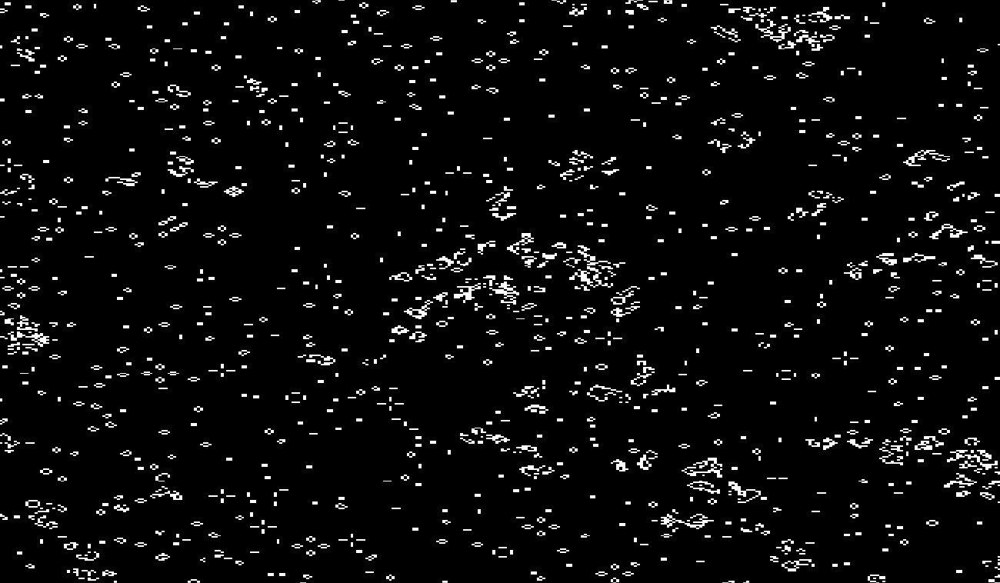

# Conways-Game-Of-Life

Conways game of life visually implemented in Go using opengl. Different techniques are used to try to optimize framerate.

### Naive

Naive is rendering every square with a call to draw arrays setting a new uniform for position and color each time.

~500fps at 25x25

~80fps at 100x100

~3.7fps at 500x500

~0.8fps at 1000x1000

### One color

One color only renders one color's squares and the other color's squares are rendered because of the background being set to that each time.

~625fps at 25x25

~600fps at 100x100

~78fps at 500x500

~11fps at 100x1000

### Only updated tiles

Only updated tiles keeps track of the board before and the board now and only needs to render the tiles that actually get updated. To do this I needed to utilize a framebuffer because just using the screen was running into issues. As a result of the framebuffer it was very diffucult to get resizing working properly so I didn't.

There are two times listen. One is from the start and the second is 30 seconds later. This is relevant to rendering only updated tiles because at the start there is a 50-50 chance for tiles to be alive or dead. This causes a lot of updating to happen until it settles more. This causes a lot more time to be used at the start.

~400-430fps at 25x25

~250-350fps at 100x100

~8-60fps at 500x500

~1-13fps at 1000x1000

### Instancing 

Instancing takes advantage of using the Instancing feature in OpenGl to avoid CPU and GPU communication when drawing a lot of the same objects. 

~600fps at 25x25

~585fps at 100x100

~265fps at 500x500

~80fps at a 1000x1000

### Chunks

This method will take a chunk size (we are going to assume that numX divides this size for simplicity). We will then generate 2^chunkSize VAOs that represent each of the possible color combinations of the chunksize. We will then lookup the chunksize.

### Depth buffer

This method tries to take advantage of the depth buffer. We only render squares once. Well twice for each square two for each color. Then we only update the depth buffer value and allow depth testing to do the rest.

### Geometry shader

This method uses a geometry shader to only need to render a pixel for each point then the geometry shader transforms this pixel into each square.

